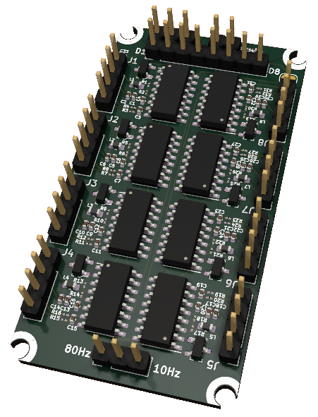
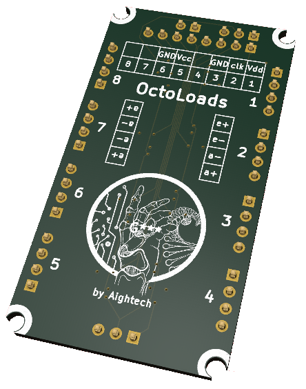

# OctoLoads: 8-Channel Load Cell Measurement PCB

OctoLoads is an 8-channel load cell measurement Printed Circuit Board (PCB) designed for projects that require simultaneous readings from multiple load cells. With 8 HX711 modules on a single board, it offers a practical and efficient solution for managing and synchronizing measurements across several load cells.

## Visualisation
Top             |  Bottom 
:-------------------------:|:-------------------------:
 |  

## Features

    8 HX711 modules for measuring up to 8 load cells simultaneously
    Shared clock bus for perfectly synchronized measurements
    Selectable sampling rate: 10Hz or 80Hz
    Compatible with various load cells
    Optimized PCB layout for signal integrity, power distribution, and thermal management

## Applications

    Industrial weighing systems
    Multi-axis force/torque measurements
    Robotics and automation
    Agricultural and food processing equipment
    Fitness and sports equipment

## Getting Started

    Hardware Setup: Connect your load cells to the octoLoads board following the appropriate wiring diagram provided in the documentation.

    Sampling Rate Selection: Choose between the two available sampling rates (10Hz or 80Hz) by setting the jumper on the board as described in the documentation.

    Microcontroller Integration: Connect the octoLoads board to your microcontroller or processing unit, and utilize the provided library or API for seamless integration.

    Software Setup: Import the provided octoLoads library into your project, and follow the example code in the documentation to start taking measurements from your load cells.

## Documentation

Detailed documentation, including schematics, layout files, and instructions for use, is available in the docs folder.

## Support

For any questions or issues, please raise an issue'

## License
This project is licensed under the MIT License - see the LICENSE file for details.

## Code
### Building source code

To build the project run:
```bash
cd octoLoads
mkdir build && cd build
cmake .. && make
```

### Demonstration app

When the project have been built, you can run:
```bash
./octoLoads -h
```
to get the demonstration app usage.

### Example
Open the  file to get an example how to use the lib.
